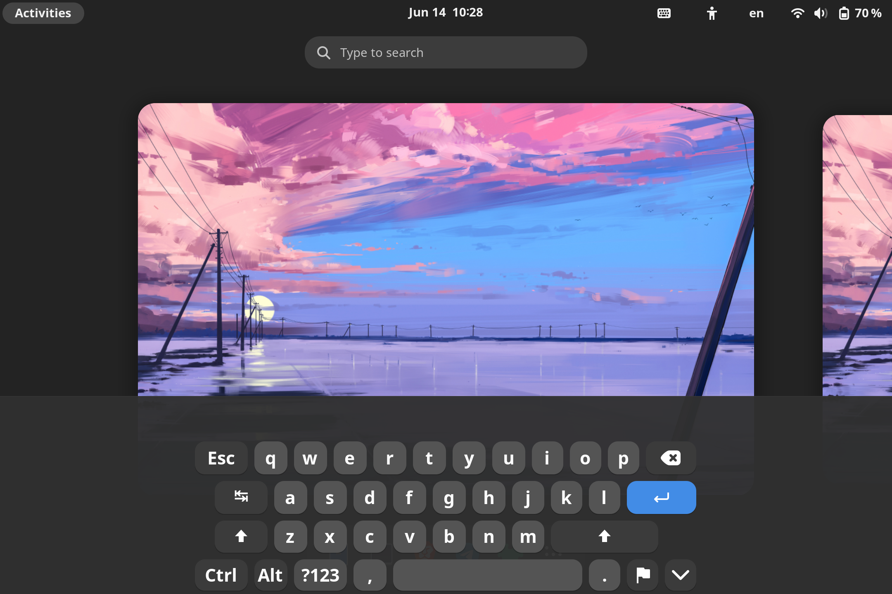
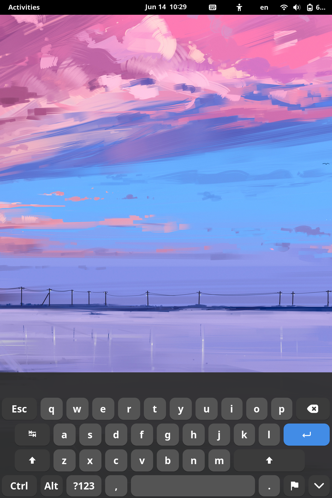

# improved-osk-gnome-ext

This is a fork of https://github.com/nick-shmyrev/improved-osk-gnome-ext but simplified:

* Stock layout with a bare minimum of extra keys (Ctrl, Alt, Esc, Tab)
* No custom sizing, fits in portrait
* No custom CSS (stock Gnome colors)

